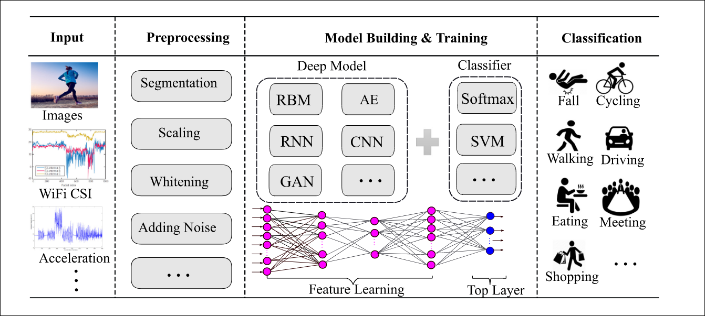

Figure 1: Overview of deeplearning for HAR [1]

# ✨ Examples for HAR for Sensors

本项目将会以数据集为对象，对基于传感器的HAR的各种Baseline算法进行实现。目前主流的方法有两大类：

- 特征工程+机器学习算法
- 深度学习算法

项目中都会进行实现。 

## 🚧 TODO List

这是目前的进度： 

- 🚧(DOING) UCI HAR [\[link\]](https://www.kaggle.com/datasets/drsaeedmohsen/ucihar-dataset)
- WISDOM [\[link\]](https://archive.ics.uci.edu/ml/datasets/WISDM+Smartphone+and+Smartwatch+Activity+and+Biometrics+Dataset+)
- PAMAP2 [\[link\]](http://archive.ics.uci.edu/ml/datasets/pamap2+physical+activity+monitoring)
- OPPORTUNITY [\[link\]](https://archive.ics.uci.edu/ml/datasets/opportunity+activity+recognition)
- UNIMIB-SHAR [\[link\]](http://www.sal.disco.unimib.it/technologies/unimib-shar/)
- USC-HAD [\[link\]](https://sipi.usc.edu/had/)
- mHealth

# Reference

[1] Gu, F., Chung, M.-H., Chignell, M., Valaee, S., Zhou, B., & Liu, X. (2022). A Survey on Deep Learning for Human Activity Recognition. ACM Computing Surveys, 54(8), 1–34. https://doi.org/10.1145/3472290
