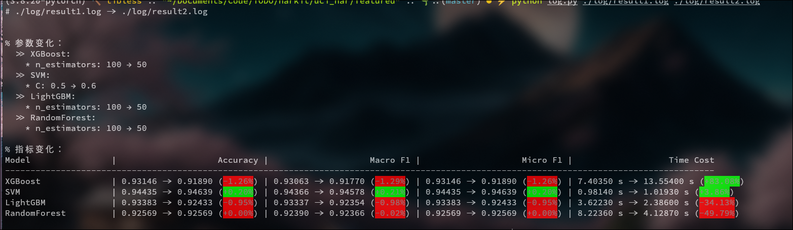

# Models on UCI HAR

UCI HAR是一种用于解析人类活动和运动的数据集。它是由UCI机器学习实验室开发的。它是从UCI机器学习实验室的UCI HAR数据集中提取的，共`train:test=7352:2974`。该数据集包含两个部分，一部分是经过特征工程之后的训练集，一个是原始数据集经过活动窗口之后分割得到的数据窗口。二者的一些简略信息大致如下：  

- 特征工程处理之后的数据集: 

这个部分在`X_train.txt`文件里，包括561个经过精心设计的特征，你可以在[Kaggle](https://www.kaggle.com/datasets/drsaeedmohsen/ucihar-dataset)上查看这个数据集的详细信息。包括一些优秀的机器学习竞赛者对于这个数据集的分析。同时，该项目的`featured/data_analysis.py`中也包含了一个对于这个数据集的简单分析。  

- 原始数据集:  

这个部分在`Inertial Signals/`文件夹里，包含9个不同维度的传感数据，并且已经按照128个时间步长的窗口大小以及50%的重叠率分割好。  


## featured 

这个里面是将一些机器学习算法应用到经过处理的featured数据集，然后评估这些算法的表现，并进行对比。并且这里提供了一个简略的日志分析工具便于使用者调参。运行结果日志将会存储到`log/`文件夹里面，每个日志包含算法的参数和运行结果（通过各项指标确定），如下： 

```
>> DecisionTree: 3.0999 s
 * ccp_alpha: 0.0
 * class_weight: None
 * criterion: gini

...

>> MLP: 3.7764 s
 * hidden_size: 561 -> 128 -> 64 -> 32 -> 6
 * lr: 0.001
 * optimizer: Adam
 * loss: CrossEntropyLoss
 * epochs: 500


Model                |   Accuracy |   Macro F1 |   Micro F1
------------------------------------------------------------
DecisionTree         |    0.86054 |    0.85744 |    0.86054
RandomForest         |    0.92569 |    0.92390 |    0.92569
XGBoost              |    0.93146 |    0.93063 |    0.93146
SVM                  |    0.94435 |    0.94366 |    0.94435
LightGBM             |    0.93383 |    0.93337 |    0.93383
MLP                  |    0.95317 |    0.95293 |    0.95317
```

同时运行： 

```bash
python log.py ./log/result1.log ./log/result2.log
```

会分析两个日志的结果的改进，如下： 




但是注意，只有结果变化会被显示，没有变化的不会被显示。  

目前已经完成的： 

- DecisionTree 
- RandomForest 
- XGBoost 
- AdaBoost 
- LightGBM 
- SVM 
- MLP  


## raw 

这个文件夹处理了原始数据集，但是目前进度还没有推进到制作一个比较好的日志，我们考虑结合上面的的日志系统来开发一个更加广泛的日志体系，以便于调试和分析。 
目前已经完成的部分：  

- MLP 
- Conv2d with single channel 
- Conv1d with multiple channels 
- Basic RNN 
- Basic LSTM 
- Basic GRU 
- BiLSTM 
- BiGRU 

TODO的部分: 

- ConvLSTM 
- ResBiLSTM [[Zhao et al. (2017)](https://arxiv.org/abs/1708.08989)]


# Reference 

- Zhao, Y., Yang, R., Chevalier, G., & Gong, M. (2017). Deep Residual Bidir-LSTM for Human Activity Recognition Using Wearable Sensors. arXiv preprint [arXiv:1708.08989](https://arxiv.org/abs/1708.08989). 
